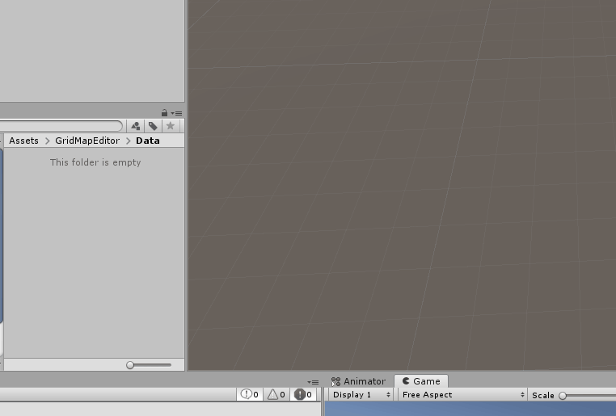
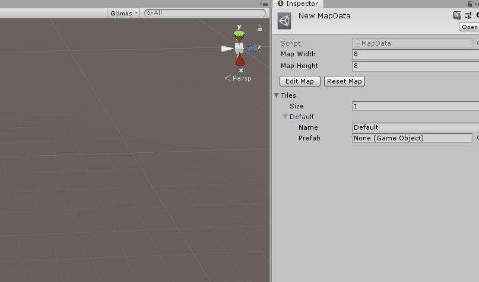
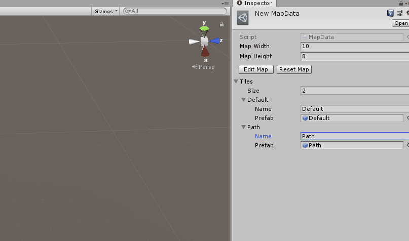
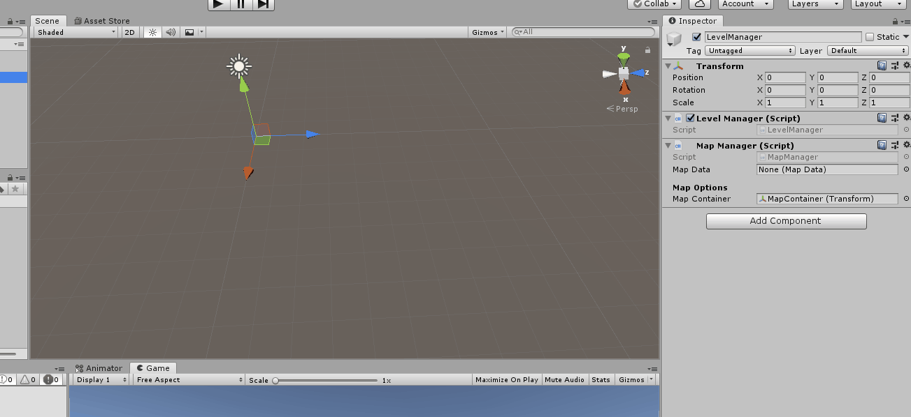

# Grid Map Editor

## Info

This editor greatly simplify grid maps creation by creating a customized Scriptable Object for every level in the game.

An in-game map will be generated based on the prefabs inserted in the Scriptable Object.

## Instructions

### Step 1
    

Scriptable Object creation.

### Step 2

Scriptable Object setup. The object can contain any number of tile types.

### Step 3

Set the color for every tile type and then create the map by coloring every tile of the grid shown.

### Step 4

The Map Manager script is an example script that will generate the in-game map. I suggest to personalize this script to your needs.